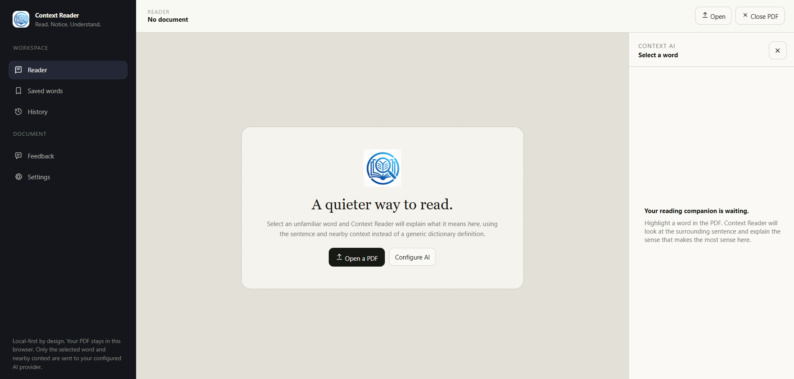
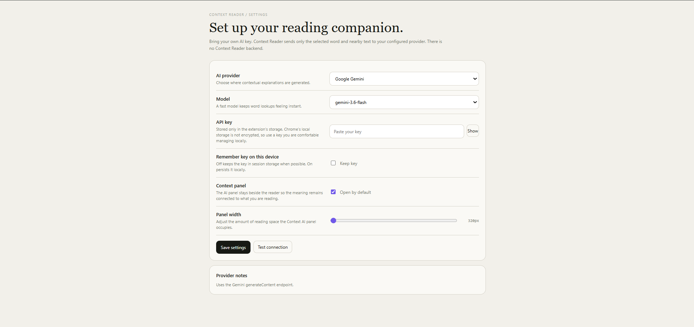
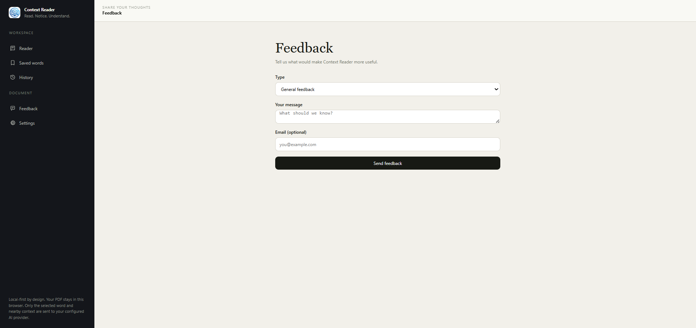
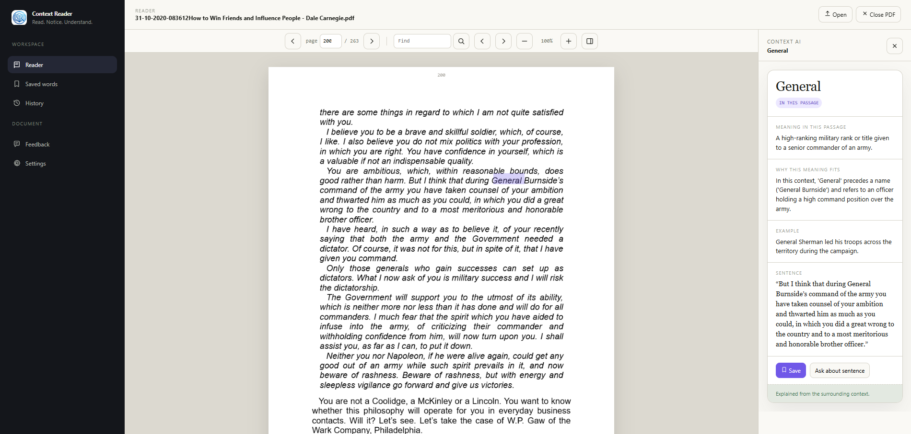

# Context Reader

> The ZIP contains a top-level `context-reader` folder. Run all npm commands from inside that folder.

A Manifest V3 Chrome extension that explains unfamiliar PDF words using the sentence and nearby context rather than a generic dictionary definition.


## Screenshots









## What works in this MVP

- Dedicated extension reader page instead of a cramped toolbar popup
- Local PDF upload and drag-ready reader entry point
- PDF.js rendering with selectable text overlay
- Open and Close PDF controls with refresh persistence
- Find words or phrases across the PDF with highlighted matches, result counts, and previous/next result navigation
- Word selection → sentence/paragraph context extraction
- Contextual AI request through the MV3 service worker, using the selected word and nearby sentence/paragraph
- BYO API key settings
- OpenAI, Google Gemini, NVIDIA NIM, and a token-free dummy provider abstraction
- Structured contextual responses with a meaning, explanation, and same-sense example
- Local IndexedDB history and saved words
- Context AI side panel
- Feedback form with type, message, and optional email fields
- Local feedback backend that stores submissions in `feedback.jsonl`
- Settings, loading, success, and error states
- Local-first design: PDFs are not uploaded to a Context Reader backend

## Install for development

1. Install Node.js 20+.
2. Run `npm install`.
3. Run `npm run build`.
4. Open `chrome://extensions`.
5. Turn on **Developer mode**.
6. Choose **Load unpacked**.
7. Select the generated `dist/` folder.
8. Click the extension icon and choose **Open Reader**.
9. Open Settings and choose **Dummy (development)** for token-free local testing, or add an API key for OpenAI, Gemini, or NVIDIA NIM.

### Supported AI providers

- **OpenAI**: `gpt-4.1`, `gpt-4.1-mini`, `gpt-4.1-nano`, `gpt-4o`, `gpt-4o-mini`, `o3`, `o3-mini`, or `o4-mini`, through the OpenAI chat completions API
- **Google Gemini**: `gemini-3.6-flash`, `gemini-3.6-pro`, `gemini-2.5-pro`, `gemini-2.5-flash`, or `gemini-2.5-flash-lite`, through Gemini `generateContent`
- **NVIDIA NIM**: `muse/glimmer-30b`, `moonshotai/kimi-k3`, or `deepseek-ai/deepseek-v4-flash-0731`, through NVIDIA's OpenAI-compatible chat completions API
- **Dummy (development)**: `dummy-local`, with deterministic local answers and no API key

## Feedback backend

Run `npm run feedback-server` from this folder while testing the feedback form. It listens on `http://localhost:8787` and appends submissions to `feedback.jsonl`.

## Notes

The build expects `pdfjs-dist` to be installed locally. PDF.js is bundled from the npm package so the extension does not rely on remote JavaScript at runtime.

The current provider permissions are intentionally limited to OpenAI, Google AI, and NVIDIA NIM. The **Dummy (development)** provider runs deterministic answers locally and makes no network requests. If you add another fixed provider, add its origin narrowly to `host_permissions` and to the provider registry. Do not turn custom user-entered URLs into unrestricted host permissions.

Chrome local storage is not encrypted. The settings UI makes this explicit. With **Remember key off**, the extension prefers `chrome.storage.session`; with it on, the key is persisted locally.

The reader persists the currently opened PDF locally so an accidental refresh can restore it, along with the last page viewed. Saved/history items still keep metadata and context rather than exposing the original PDF outside this browser.

The reading prompt is defined in `src/lib/ai.ts`. It requires JSON with exactly `meaning`, `explanation`, and `example` fields, and asks each provider to prioritize the selected word's meaning in its surrounding passage. NVIDIA NIM requests are explicitly non-streaming and bounded to 512 output tokens; provider error responses expose the API's diagnostic detail in Settings.

## Architecture

```text
reader.html
  ├─ PDF.js rendering + text layer
  ├─ selection/context extraction
  ├─ React UI
  └─ chrome.runtime messaging
           ↓
    MV3 service worker
           ↓
    provider adapter → AI API
           ↓
    structured JSON → Context AI panel
```

## Design reference

The visual language is documented in `DESIGN.md` and was shaped by the provided Taste Skill, Vercel Web Design Guidelines, and Awesome DESIGN.md references. PDF.js is used as the rendering foundation rather than embedding the unmodified stock viewer.
